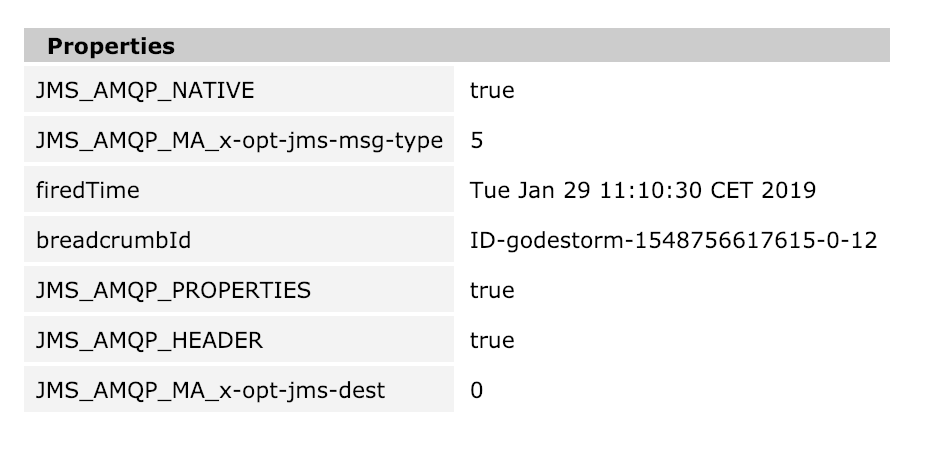

= Spring Boot AMQP based JmsListener fails on TextMessage

This SpringBoot application shows a problem retrieving JMS messages of type `TextMessage` from an ActiveMQ broker.

It consists of a producer component and a consumer component.

If the consumer tries to retrieve messages from the broker it cannot automatically convert a message to `TextMessage` but treats it as `ByteMessage`.
There is a link:springboot-jms-consumer/src/main/java/net/aschemann/demo/springboot/jmsconsumer/JmsConsumer.java[`JmsListener`] which should read the messages from the queue as `TextMessage`:

[source, java]
----
...
include::springboot-jms-consumer/src/main/java/net/aschemann/demo/springboot/jmsconsumer/JmsConsumer.java[lines=13..14]
...
----

The `JmsListener` produces warnings like the following, and drops the messages:

  org.springframework.jms.listener.adapter.ListenerExecutionFailedException: Listener method could not be invoked with incoming message
  Endpoint handler details:
  Method [public void net.aschemann.demo.springboot.jmsconsumer.JmsConsumer.jmsConsumer(javax.jms.TextMessage)]
  Bean [net.aschemann.demo.springboot.jmsconsumer.JmsConsumer@4715f07]; nested exception is org.springframework.messaging.converter.MessageConversionException: Cannot convert from [[B] to [javax.jms.TextMessage] for org.springframework.jms.listener.adapter.AbstractAdaptableMessageListener$MessagingMessageConverterAdapter$LazyResolutionMessage@7c49d298, failedMessage=org.springframework.jms.listener.adapter.AbstractAdaptableMessageListener$MessagingMessageConverterAdapter$LazyResolutionMessage@7c49d298
  	at org.springframework.jms.listener.adapter.MessagingMessageListenerAdapter.invokeHandler(MessagingMessageListenerAdapter.java:118) ~[spring-jms-5.1.4.RELEASE.jar:5.1.4.RELEASE]

The producer uses Apache Camel to create JMS messages and they are stored in the Broker with `jms-msg-type=5` which is the right format according to https://www.oasis-open.org/committees/download.php/56418/amqp-bindmap-jms-v1.0-wd06.pdf[].

If you want to reproduce the error, you have to perform the following steps

* Start an ActiveMQ broker, e.g., via Docker:
+
  docker run --name='activemq' -it --rm -p 61616:61616 -p 5672:5672 -p 8161:8161 webcenter/activemq:latest

* Start the producer application to generate a number of messages for the queue `foo`:

  mvn -pl springboot-camel-jms-producer spring-boot:run

* Check that some messages where produced in queue `foo`: http://localhost:8161/admin/browse.jsp?JMSDestination=foo[]

* Check that the messages have the mentioned `jms-msg-type=5` (Property: `JMS_AMQP_MA_x-opt-jms-msg-type`) by clicking on one of them
+

* Start the consumer application to see the error when retrieving the messages:

  mvn -pl springboot-jms-consumer spring-boot:run
